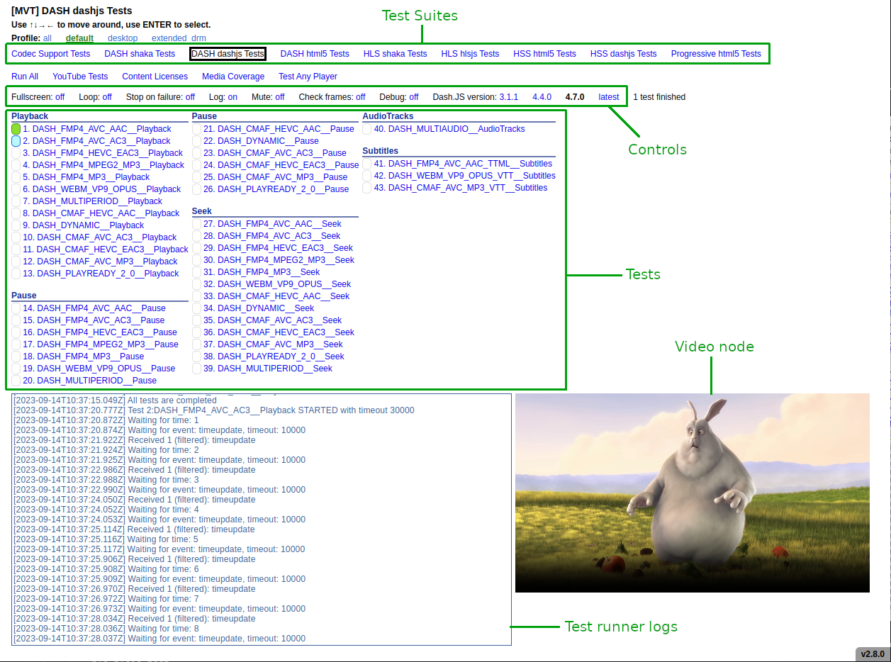
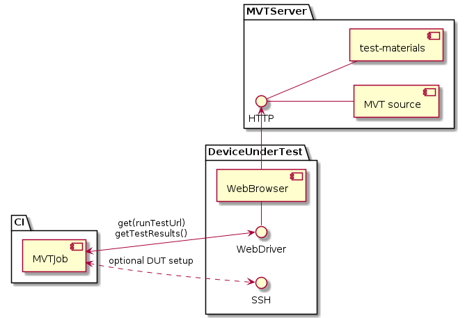

<!---
- If not stated otherwise in this file or this component's LICENSE file the
- following copyright and licenses apply:
-
- Copyright 2022 Liberty Global B.V.
-
- Licensed under the Apache License, Version 2.0 (the "License");
- you may not use this file except in compliance with the License.
- You may obtain a copy of the License at
-
- http://www.apache.org/licenses/LICENSE-2.0
-
- Unless required by applicable law or agreed to in writing, software
- distributed under the License is distributed on an "AS IS" BASIS,
- WITHOUT WARRANTIES OR CONDITIONS OF ANY KIND, either express or implied.
- See the License for the specific language governing permissions and
- limitations under the License.
--->

# Media Validation Tool (MVT)

Tool for verification of browser's media playback capabilities.

Supports four streaming formats and four different players:

- Progressive (native)
- DASH (native, Shaka Player, dash.js)
- HLS (Shaka Player, hls.js)
- Smooth Streaming (native, dash.js)

Test streams use different audio/video/subtitles codecs and media containers. For details, see [coverage](#coverage) section.

## Source

    git clone git@github.com:stagingrdkm/MVT.git
    ./prepare_submodule.sh

### Relation to js_mse_eme

MVT is built on top of YouTube's test tool [js_mse_eme](https://github.com/youtube/js_mse_eme), which is used as a git submodule and provides test execution framework and UI.

MVT introduces new tests, integration of MSE players and various media assets.

## Deployment

    # Build httpd based image and copy source files into it
    ./docker_build.sh

    # Set host directory to store media assets (~1,5 GB)
    # Default value: /data/test-materials
    export TEST_MATERIALS_SRC=/data/test-materials

    # Run container with http server on host port 8080
    PORT=8080 ./docker_run.sh

    # Populate |TEST_MATERIALS_SRC| with media assets.
    # Existing assets won't be overridden.
    # Runs withing running container (mvt-app) and takes ~30 minutes on decent PC.
    ./docker_prepare_assets.sh

Up and running MVT instance: http://localhost:8080

### Stop MVT

    docker stop mvt-app

### Update application source

First cleanup old image:

    docker stop mvt-app
    docker rmi mvt-app-img

then repeat [deployment](#deployment) steps.

### Refresh media assets

Media assets are stored on host file system and are not overridden by default.

In order to regenerate all media assets simply remove the test-materials directory:

    rm -rf $TEST_MATERIALS_SRC
    ./docker_prepare_assets.sh

### External media dependencies

A list of of all external media assets used by a deployed instance of MVT:

| Stream             | Source                                                                           | URL                                                                                                                                           | Notes                                                                                                                                       |
| ------------------ | -------------------------------------------------------------------------------- | --------------------------------------------------------------------------------------------------------------------------------------------- | ------------------------------------------------------------------------------------------------------------------------------------------- |
| Big Buck Bunny     | https://peach.blender.org/                                                       | https://mirrors.dotsrc.org/blender/blender-demo/movies/BBB/bbb_sunflower_1080p_30fps_normal.mp4                                               | Licensed under Creative Commons 3.0: https://peach.blender.org/about/ <br /> Used as a base stream for assets hosted under `test-materials` |
| Tears of Steel     | https://mango.blender.org/                                                       | http://ftp.nluug.nl/pub/graphics/blender/demo/movies/ToS/ToS-4k-1920.mov                                                                      | Licensed under Creative Commons 3.0: https://peach.blender.org/about/ <br /> Used as a base stream for assets hosted under `test-materials` |
| DASH-CMAF-HEVC-AAC | [DASH IF](https://testassets.dashif.org/)                                        | https://dash.akamaized.net/dash264/TestCasesIOP41/CMAF/UnifiedStreaming/ToS_HEVC_MultiRate_MultiRes_AAC_Eng_WebVTT.mpd                        | Not distributed by MVT, used for playback during test execution                                                                             |
| DASH-DYNAMIC       | [DASH IF](https://testassets.dashif.org/)                                        | https://livesim.dashif.org/livesim/mup_300/tsbd_500/testpic_2s/Manifest.mpd                                                                   | Not distributed by MVT, used for playback during test execution                                                                             |
| HLS-CMAF-AVC1-AAC  | [DASH IF](https://testassets.dashif.org/)                                        | https://media.axprod.net/TestVectors/v9-MultiFormat/Clear/Manifest_1080p.m3u8                                                                 | Not distributed by MVT, used for playback during test execution                                                                             |
| HLS-CMAF-HEVC-AAC  | [DASH IF](https://testassets.dashif.org/)                                        | https://dash.akamaized.net/dash264/TestCasesIOP41/CMAF/UnifiedStreaming/ToS_HEVC_MultiRate_MultiRes_IFrame_AAC_WebVTT.m3u8                    | Not distributed by MVT, used for playback during test execution                                                                             |
| DASH-PLAYREADY-2.0 | [Microsoft PlayReady](https://testweb.playready.microsoft.com/Content/Content2X) | http://profficialsite.origin.mediaservices.windows.net/c51358ea-9a5e-4322-8951-897d640fdfd7/tearsofsteel_4k.ism/manifest(format=mpd-time-csf) | Not distributed by MVT, used for playback during test execution                                                                             |
| HSS-AVC1-AAC       | [Microsoft PlayReady](https://testweb.playready.microsoft.com/Content/Content2X) | http://amssamples.streaming.mediaservices.windows.net/683f7e47-bd83-4427-b0a3-26a6c4547782/BigBuckBunny.ism/manifest(format=mpd-time-csf)     | Not distributed by MVT, used for playback during test execution                                                                             |
| HSS-AVC1-AAC       | [Microsoft PlayReady](https://testweb.playready.microsoft.com/Content/Content2X) | http://profficialsite.origin.mediaservices.windows.net/c51358ea-9a5e-4322-8951-897d640fdfd7/tearsofsteel_4k.ism/manifest                      | Not distributed by MVT, used for playback during test execution                                                                             |

## Development

1. [Deploy](#deployment) the application
2. [Stop the container](#stop-mvt) - it works on build-time static copy of source files
3. Start development container with:

```
docker run -v $PWD/:/usr/local/apache2/htdocs -v $TEST_MATERIALS_SRC:/usr/local/apache2/htdocs/test-materials -p 8080:80 --rm -d -it --name mvt-app mvt-app-img:latest
```

Now you can modify MVT source code and observe changes on: http://localhost:8080

### Prettier

Source files are auto formatted by [prettier](https://prettier.io/), which should be used before committing any changes:

    prettier -w .

## User Interface



Tests are grouped into test suites, which differ in streaming type (DASH, HLS, HSS, progressive) and player (Shaka Player, dash.js, hls.js, native).

The test list is generated dynamically based on available streams (`mediaStreams.js`), test templates
(`src/commonTests.js`) and selected hardware configuration (e.g. `src/hardwareConfigDefault.js`).
Each test is actually an instantiation of a test template e.g. `DASH-FMP4-AVC1-AAC Playback` and
`DASH-DYNAMIC Playback` share the same test code (`src/commonTests.js::testPlayback`),
but use different media stream.

There are six media test templates:

- `Playback` verifies basic playback and media position progress on the span of 10 seconds
- `Pause` verifies if browser is capable of pausing a stream
- `Rate` verifies playback with various playback rates
- `Position` executes seek operation
- `AudioTracks` changes audio track
- `Subtitles` activates text tracks and verifies its content

During test execution test runner logs are printed into JavaScript console and into a div below tests list. The video under test can be observed on the right-hand side of main view.

All interactive elements are navigable via arrow keys and can be selected through [URL parameters](#url-parameters).

### URL parameters

Test execution can be controlled through URL parameters, e.g. to run `DASH Shaka` tests 1,2,3 on Shaka Player version 2.5.20 use:

    http://MVT_INSTANCE_ADDRESS?test_type=dash-shaka-test&tests=1-3&engine_shaka_player=2.5.20

Most of the URL parameters can be combined. Here's a full list of supported queries:

- `test_type=SUITE_NAME` - test suite selection. Expected values:
  - codecsupport-test
  - dash-html5-test
  - dash-shaka-test
  - dash-dashjs-test
  - dash-playready-shaka-test
  - dash-playready-dashjs-test
  - hls-shaka-test
  - hls-hlsjs-test
  - hss-html5-test
  - progressive-html5-test
- `command=run` - test run autostart. Please note it may not work on desktop browser, because they tend to block autoplay before user interaction.
- `tests=ID[,ID]|ID-ID2` - tests subset selection. Expected values:
  - Single test id e.g. `tests=1`
  - Multiple test ids e.g. `tests=1,5,13`
  - Test ids range e.g. `tests=1-10`
- `exclude=ID[,ID]|ID-ID2` - exclude subsets of tests
- `checkframes=false|true` - enable verification of video frames progress based on `video.getVideoPlaybackQuality().totalVideoFrames`
- `loop=false|true`
- `stoponfailure=false|true`
- `disable_log=false|true`
- `engine_shaka_player=2.5.20|3.0.1|3.2.1` - select Shaka Player version. Please note it will only affect Shaka test suites.
- `engine_dashjs_player=2.9.3|3.0.1|latest` - select dash.js version. Please note it will only affect dash.js test suites.

### JavaScript API

`getTestResults()` is a globally available JavaScript function, which can be run from console or via WebDriver to gather the results.
It produces a JSON-like object, which should be easy to read by any automated test runner. Sample output:

```
{
    "name": "codecsupport-test",
    "setup_log": "",
    "suites": [],
    "teardown_log": "",
    "tests": [
        {
            "log": "[2022-05-04T12:27:02.799Z] TestExecutor:  Test 1:video/mp4; codecs=\"avc1.64002a\"(avc1) STARTED with timeout 30000 \n[2022-05-04T12:27:02.800Z] TestExecutor:  checking video/mp4; codecs=\"avc1.64002a\" \n[2022-05-04T12:27:02.800Z] TestExecutor:  Test 1:video/mp4; codecs=\"avc1.64002a\"(avc1) PASSED. \n",
            "name": "video/mp4; codecs=\"avc1.64002a\"(avc1)",
            "status": "passed",
            "suites_chain": "MVT_SUITE.codecsupport-test",
            "time_ms": 2,
            "type": "test_result",
            "ver": "1.0"
        },
        {
            "log": "[2022-05-04T12:27:02.804Z] TestExecutor:  Test 2:video/mp4; codecs=\"hvc1.2.4.L153.00\"(hevc) STARTED with timeout 30000 \n[2022-05-04T12:27:02.805Z] TestExecutor:  checking video/mp4; codecs=\"hvc1.2.4.L153.00\" \n[2022-05-04T12:27:02.805Z] TestExecutor:  Test 2:video/mp4; codecs=\"hvc1.2.4.L153.00\"(hevc) FAILED \n[2022-05-04T12:27:02.807Z] TestExecutor:  Test 0.0.0.1:video/mp4; codecs=\"hvc1.2.4.L153.00\"(hevc) threw an error: Assert failed: canPlayType should be probably for video/mp4; codecs=\"hvc1.2.4.L153.00\" \n",
            "name": "video/mp4; codecs=\"hvc1.2.4.L153.00\"(hevc)",
            "status": "failed",
            "suites_chain": "MVT_SUITE.codecsupport-test",
            "time_ms": 4,
            "type": "test_result",
            "ver": "1.0"
        }
    ],
    "type": "suite_result",
    "ver": "1.0"
}
```

### Coverage

`/coverage.html` provides a detailed view of media test coverage.

- <span style="color:yellow">Unsupported</span> - case is unsupported, either by container, player or WPEWebKit.
- <span style="color:red">Supported, no content</span> - case is not covered by MVT test suite.
- <span style="color:green">Supported</span> - case is represented by `x` media streams. Please note that it does not mean that related tests pass on the active device - it is just a coverage view which does not verify test results.


## Continuous Integration

MVT provides API for triggering tests and gathering results,
therefore it can be employed in an automated testing system.
A recommended setup is presented on below diagram:



### MVTServer

Deployed application from this repository.

#### MVT source

HTML, JavaScript and CSS sources from this repository.

#### test-materials

Directory with media assets generated during deployment (see `prepare_media_assets.sh`)

### DeviceUnderTest (DUT)

#### WebBrowser

WebBrowser under test (e.g. WPEWebKit).

#### WebDriver

[WebDriver client](https://www.selenium.dev/documentation/webdriver/) for test run control.

#### SSH

Interface that may be used during test setup/cleanup for any additional DUT configuration (e.g. starting WebDriver, gathering artifacts).

### CI

Any CI system which executes MVTJob regularly (e.g. Jenkins).

#### MVTJob

CI job which setups DUT, starts test suites and gathers results.
In example, to execute `DASH shaka` test suite the test runner should:

1. Start `WebBrowser` and connect to `WebDriver`
2. Start test suite by setting URL to `http://MVT_INSTANCE_ADDRESS?test_type=dash-shaka-test&command=run`
3. Wait till tests finishes i.e. till `WebDriver`'s:

   `return globalRunner.currentTestIdx == globalRunner.testList.length`

   command evaluates to true.

4. Fetch test results through `WebDriver` with `return getTestResults()`
5. Parse JSON test results to adjust it for the format expected by CI system.

Same procedure can be repeated for each test suite in order to make fully automated MVT test run.
